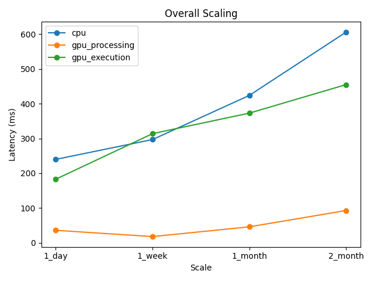
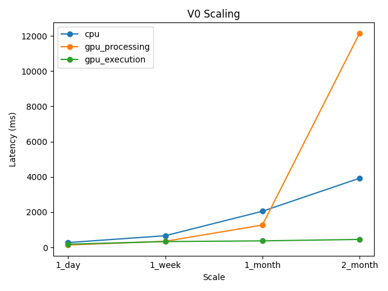
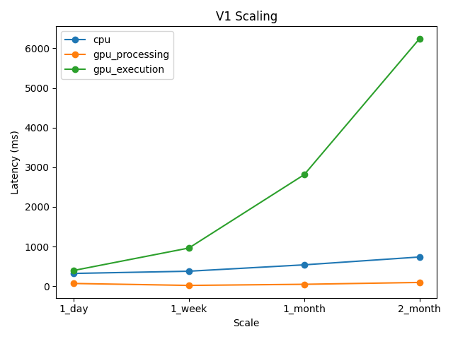
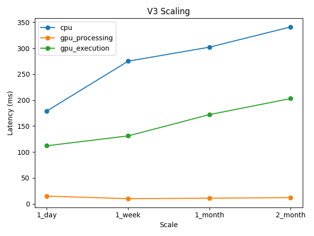

# GPU vs CPU Performance Analysis - Mar 27, 2026

## Summary

The results show that performance is primarily driven by data representation rather than hardware alone. 

Across all scales, the dictionary-encoded version (V3) consistently delivers the strongest performance, achieving stable speedups of ~25–30× with gpu_processing and maintaining ~1.6–2× speedup even with gpu_execution.

Importantly, V3 scales well: latency remains nearly flat as data grows from one day to two months (e.g., ~10–15 ms for gpu_processing), indicating that integer-based joins enable efficient parallel execution and good memory locality on the GPU.

In contrast, the string-based version (V1) exhibits significantly worse scaling behavior. While gpu_processing still provides speedups (up to ~20× at moderate scales), gpu_execution degrades sharply as data size increases, becoming up to ~8–9× slower than CPU at larger scales. This highlights the high cost of string hashing and poor memory efficiency in join-heavy workloads, especially under out-of-core execution.

---

## Overall Scaling

**Figure 1 — Global latency scaling across engines**

---

## Aggregation Workload (V0 / Q01)

The aggregation-only workload behaves differently from join-heavy queries:

- At small scales: GPU provides modest speedups (~1.5–2×)
- At large scales:
  - gpu_processing degrades significantly (~0.32× at 2 months)
  - gpu_execution improves substantially (up to ~8.6×)

This suggests:
- In-memory GPU execution struggles with large scan-heavy workloads
- Out-of-core execution is better suited for large aggregations

### V0 Scaling

---

## String-Based Joins (V1)

The string-based version (V1) exhibits significantly worse scaling behavior:

- gpu_processing shows good speedups at smaller scales
- gpu_execution degrades sharply with scale
- Becomes significantly slower than CPU at large sizes

This highlights:
- High cost of string hashing
- Poor memory locality
- Inefficiency in join-heavy workloads

### V1 Scaling

---

## Dictionary-Encoding (V3)

The dictionary-encoded version (V3) delivers the best performance:

- Stable ~25–30× speedup (gpu_processing)
- Consistent ~1.6–2× speedup (gpu_execution)
- Near-flat scaling as data grows

This demonstrates:
- Efficient integer-based joins
- Strong GPU parallelism
- Good cache and memory behavior

### V3 Scaling

---

## Global Observations

At the global level:

- gpu_processing: ~6–16× speedup
- gpu_execution: ~1–1.3× speedup

This reflects a mix of workloads with different characteristics.

---

## Key Takeaways

- Data representation (dictionary encoding) is critical for GPU performance
- Join-heavy workloads benefit most from GPU acceleration
- String-based joins severely limit scalability
- Large aggregations require out-of-core execution to remain efficient
- GPU performance is highly workload-dependent

Sirius commit: 0c198e90a870c129e6a60d7a88304dc115d6a6af
Sirius-crypto-demo commit: 886e840916b67307f72a0cbe4730215afdb37791